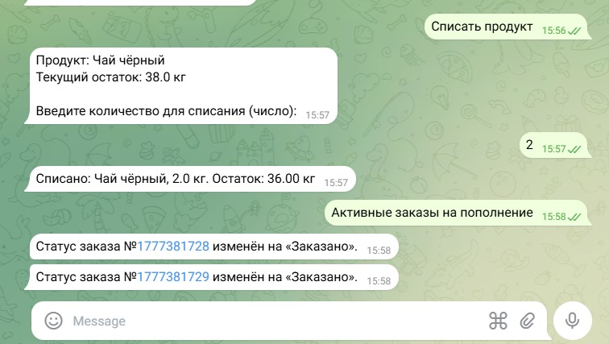
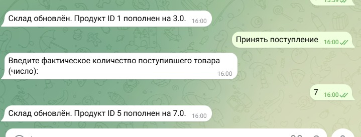
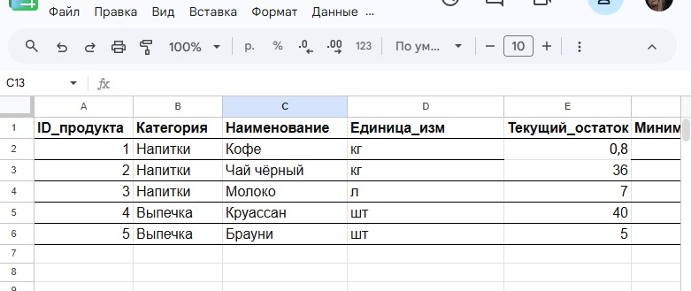
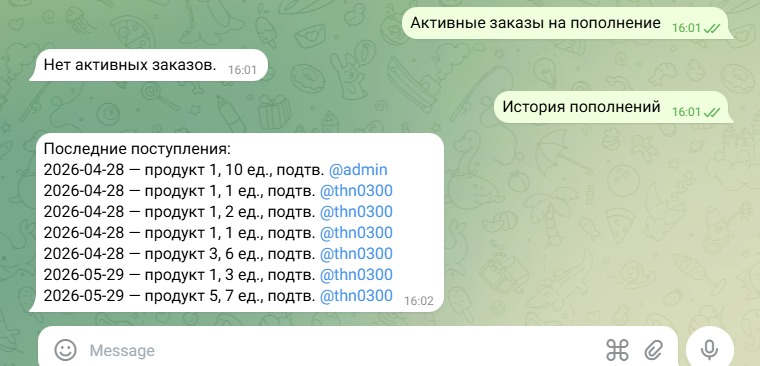
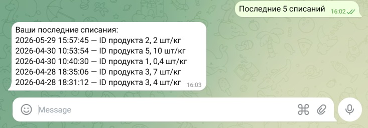
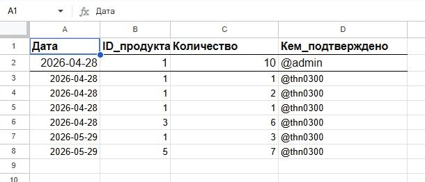

# Cafe Inventory Telegram Bot

Telegram-бот для учёта товаров в кафе с интеграцией Google Sheets.

## Возможности
- Списание товаров сотрудниками
- Автоматическое создание заказов на пополнение при падении остатков ниже минимума
- Подтверждение поступления товаров администратором
- Логирование всех операций
- Ролевая модель (сотрудник / администратор)

## Технологии
- Python 3.11
- aiogram 3
- Google Sheets API
- FSM (конечные автоматы)

## Скриншоты работы

### Списание товара (Telegram)

### Создание заказа на пополнение (Telegram)

### Приёмка товара админом (Telegram)

### Обновление остатков в Google Sheets

### Лог пополнений в Google Sheets

### История списаний сотрудника (Telegram)

### Google Sheets — лист "Расход"

### Заказ в Google Sheets (пример)

### Дополнительно — лог пополнений (другой вид)

## Как запустить (для разработчика)
1. Клонируйте репозиторий
2. Создайте виртуальное окружение
3. Установите зависимости: `pip install -r requirements.txt`
4. Создайте `config.py` по образцу `config.example.py` и вставьте свои токены/ключи
5. Запустите бота: `python bot.py`

## Примечание
Файлы `config.py` и `service_account.json` не включены в репозиторий по соображениям безопасности. Они должны быть созданы локально.
